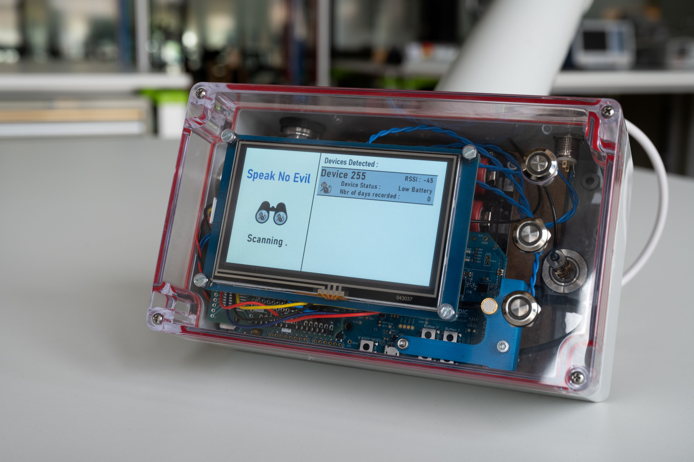
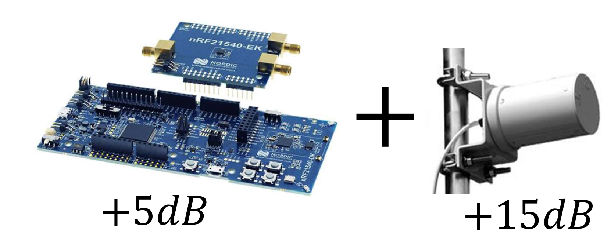
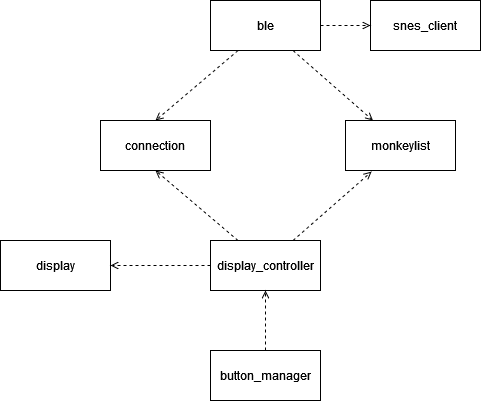

# BLE Booster
This project is part of a larger project that aims to improve a collar device designed to be worn by monkeys to record the sounds they make.

## Problematic
Actually, the collar is controlled by an application on a phone via a Bluetooth Low Energy (BLE) connection. The application can detect and connect to nearby collars. Once connected, it is possible to enable or disable recording, reset the collar, and open it. 

During field tests, opening the collar via the application was problematic due to the limited range, the distance between the phone and the collar being too great. The goal of this part of the project is to develop a device that replaces the phone, using a directional antenna and a Front-End Module (FEM) to amplify the Bluetooth signal. This new system should increase the distance at which the collar can be controlled. It takes over the functionalities of the existing mobile application. However, this device will not completely replace the smartphone. The latter also allows, when connected to a collar, to update its date and time. This function will not be implemented in the BLE Booster for simplicity. 

## Objectif
The goal of the BLE Booster is to be able to open the collar remotely, thus reducing stress for animals and the risk of disruption of their natural behavior. This remote controller will exploit Bluetooth Low Energy (BLE) technology to ensure efficient and energy-efficient communication between the collar and the control device.

## Project information
The device is based on the nRF21540-DB development kit, which contains an nRF52840 processor and an nRF21540 Front-End Module (FEM). The directional antenna, a user interface, and a battery are required to make the device usable in the field. The processor is programmed with nRF Connect and the program uses the Zephyr RTOS.

## Architecture
The program is split into two main tasks. The first is the interface management and the second is the Bluetooth management. The data is shared between the two tasks by the "monkeylist" data structure and they communicate via callback functions. The callbacks are assigned in "connection". The interface includes the screen control in "display_controller" and "display", as well as the button management in "button_manager". The Bluetooth part allows to scan the different collars, connect to them and control them. The code is split into "ble" and "snes_client". The following figure shows the interactions between the component of the system.

The project is composed of two main folder :
- **nRF** : it contain the code for the nRF21540-DB development kit.
- **display** : it contain the code for the Nextion screen.

The uml folder contains all the uml class and the sequence diagram.

